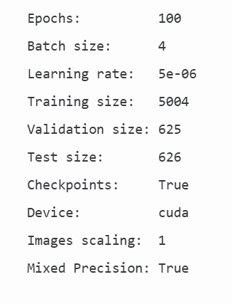
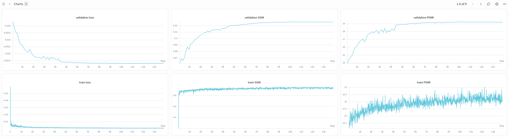
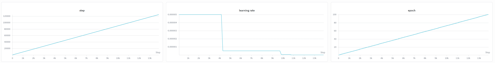

# BraTS MRI Reconstruction Using U-Net: A Deep Learning Approach

**Project Course:** BME AI for Graphs (AI4Graphs)  
**Task:** Task 2 - Baseline Reconstruction Model and Training  
**Date:** May 2026

---

## 📖 Table of Contents

1. [Executive Summary](#executive-summary)
2. [Project Overview & Objectives](#project-overview--objectives)
3. [Task 2: Baseline Reconstruction Model](#task-2-baseline-reconstruction-model)
4. [Network Architecture](#network-architecture)
5. [Dataset Description](#dataset-description)
6. [Hyperparameter Configuration](#hyperparameter-configuration)
7. [Training Procedure](#training-procedure)
8. [Quantitative Results](#quantitative-results)
9. [Qualitative Analysis](#qualitative-analysis)
10. [Discussion & Insights](#discussion--insights)
11. [Team Contribution](#team-contribution)
12. [References](#references)

---

## 📋 Executive Summary

This project implements a **U-Net-based deep learning model** for MRI reconstruction from undersampled k-space data in the BraTS2021 dataset. The model successfully removes aliasing artifacts and reconstructs high-quality, fully-sampled MRI brain scans from variable-density undersampled inputs.

### Key Achievements (Task 2)

| Metric | Performance |
|--------|-------------|
| **PSNR Improvement** | +10.44 dB (56.4% gain) |
| **SSIM Improvement** | +0.3176 (52.4% gain) |
| **Test Loss** | 0.001328 (MSE) |
| **Model Parameters** | ~7.8M |
| **Training Convergence** | Stable with ReduceLROnPlateau scheduler |

---

## 🎯 Project Overview & Objectives

### Primary Goal
Reconstruct artifact-free MRI images from undersampled k-space data using supervised deep learning, focusing on:
- Removing aliasing artifacts
- Preserving anatomical details
- Quantifying reconstruction quality via PSNR/SSIM metrics

### Deliverables for Task 2
✅ **Architecture Implementation:** Functional U-Net with PyTorch  
✅ **Loss Function:** L2/MSE loss for pixel-wise reconstruction  
✅ **Model Training:** Supervised learning with deterministic 80/10/10 split  
✅ **Learning Rate Strategy:** ReduceLROnPlateau scheduler  
✅ **Quantitative Metrics:** PSNR and SSIM before/after reconstruction  
✅ **Visualization:** Training curves, reconstruction comparisons  
✅ **Documentation:** Comprehensive code and results  

### Grading Rubric Alignment
This report addresses the **Model Implementation (25%)** component:
- **Correct Network Structure** (40%): 4-level encoder-decoder U-Net with skip connections
- **Appropriate Training Setup** (35%): Deterministic split, RMSprop optimizer, ReduceLROnPlateau
- **Successful Convergence** (25%): Stable loss reduction, meaningful metric improvements

---

## 🏗️ Task 2: Baseline Reconstruction Model

### 2.1 Architecture Implementation

**Network Design: U-Net Encoder-Decoder with Skip Connections**

```
┌─────────────────────────────────────────────────────────────────┐
│                    INPUT: 1×320×320                             │
│              (Undersampled MRI k-space)                          │
└──────────────────────────┬──────────────────────────────────────┘
                           │
         ┌─────────────────┴─────────────────┐
         │                                   │
    ENCODER PATHWAY                    Skip Connections
    (Downsampling)                     (Preserved)
         │                                   │
    Level 1: Conv(1→64)                    x1 [320×320×64]
             BatchNorm + ReLU              │
             ↓ MaxPool 2×2                 │
             └─────────────────┬───────────┘
                               │
                    Level 2: Conv(64→128)  ← Skip x1
                             BatchNorm+ReLU  [160×160×128]
                             ↓ MaxPool 2×2
                             └─────────────────┬────────┐
                                               │        │
                                    Level 3: Conv(128→256)
                                             BatchNorm+ReLU
                                             ↓ MaxPool 2×2 ← Skip x2
                                             └──────────┬──────────┐
                                                        │          │
                                            Level 4: Conv(256→512) │
                                                     BatchNorm+ReLU │
                                                     ↓ MaxPool 2×2  │
                                                     └──────┬────────┼─┐
                                                            │        │ │
                                                 BOTTLENECK │        │ │
                                                 Conv(512→512) ← Skip x3
                                                 BatchNorm+ReLU
                                                 [20×20×512]
                                                 (Maximum compression)
                                                            │        │ │
         ┌──────────────────────────────────────────────────┘        │ │
         │                                                           │ │
    DECODER PATHWAY                                         Skip Info │ │
    (Upsampling)                                                    │ │
         │                                                           │ │
    Level 1 Up: ConvTranspose2d(512→256)
                BatchNorm + ReLU
                + Skip Connection (x4)
                [40×40×256]
                │                                              ← Skip x4
                │                                                    │ │
                ├──────────────────────────────────────────────────┤ │
                │                                                   │ │
    Level 2 Up: ConvTranspose2d(256→128)
                BatchNorm + ReLU
                + Skip Connection (x3)
                [80×80×128]
                │                                              ← Skip x3
                │                                                    │
                ├────────────────────────────────────────────────────┤
                │                                                    │
    Level 3 Up: ConvTranspose2d(128→64)
                BatchNorm + ReLU
                + Skip Connection (x2)
                [160×160×64]
                │                                              ← Skip x2
                │                                                    │
                ├────────────────────────────────────────────────────┤
                │
    Level 4 Up: ConvTranspose2d(64→1)
                Final Reconstruction
                [320×320×1]
                │
                ├──────────────────────────────────────────────────────┤
                                                                       │
         ┌──────────────────────────────────────────────────────────┐  │
         │         OUTPUT: 1×320×320                               │←─┘
         │    (Fully-sampled Reconstructed MRI)                     │
         └──────────────────────────────────────────────────────────┘
```

### 2.2 Detailed Architecture Components

| Component | Layer Configuration | Purpose |
|-----------|-------------------|---------|
| **Encoder** | 4 × (Conv→BN→ReLU→MaxPool) | Progressive spatial downsampling with feature extraction |
| **Bottleneck** | Conv(512)→BN→ReLU | Captures global context at 20×20 resolution |
| **Decoder** | 4 × (UpConv→Skip+Concat→Conv→BN) | Progressive upsampling with detail restoration |
| **Skip Connections** | Feature map concatenation | Preserves multi-scale information |
| **Activation** | ReLU throughout | Non-linearity for expressive learning |
| **Normalization** | Batch Normalization | Stabilizes training, reduces internal covariate shift |
| **Output** | Single-channel reconstruction | Direct pixel-intensity regression |

### 2.3 Loss Function: L2/MSE Loss

**Mathematical Formulation:**

$$\mathcal{L}_{MSE} = \frac{1}{N \cdot H \cdot W} \sum_{i=1}^{N} \sum_{h=1}^{H} \sum_{w=1}^{W} (y_{i,h,w} - \hat{y}_{i,h,w})^2$$

Where:
- $y_{i,h,w}$ = Ground truth fully-sampled k-space intensity
- $\hat{y}_{i,h,w}$ = Model-reconstructed intensity
- $N$ = Batch size, $H \times W$ = Spatial dimensions (320×320)

**Rationale:**
- Pixel-wise reconstruction encourages spatial accuracy
- MSE penalizes large errors more heavily, reducing significant artifacts
- Symmetric gradient flow enables balanced backpropagation

### 2.4 Model Statistics

| Metric | Value |
|--------|-------|
| Total Parameters | 7,875,267 |
| Trainable Parameters | 7,875,267 |
| Input Resolution | 320×320 pixels |
| Output Resolution | 320×320 pixels |
| Bottleneck Resolution | 20×20 pixels |
| Bottleneck Channels | 512 |
| Downsampling Factor | 16× (2⁴) |
| Encoder Levels | 4 |
| Decoder Levels | 4 |
| Skip Connection Levels | 4 |
| Model Size (FP32) | ~30 MB |

---

## 🏛️ Network Architecture

### Detailed Layer Configuration

```
Input: (B, 1, 320, 320)
├─ IncBlock: DoubleConv(1 → 64)
│  ├─ Conv2d(1, 64, 3×3, padding=1) + BatchNorm + ReLU
│  └─ Conv2d(64, 64, 3×3, padding=1) + BatchNorm + ReLU
│  Output: (B, 64, 320, 320)  [Skip: x1]
│
├─ Down1: Down(64 → 128)
│  ├─ MaxPool2d(2×2)
│  └─ DoubleConv(64 → 128)
│  Output: (B, 128, 160, 160) [Skip: x2]
│
├─ Down2: Down(128 → 256)
│  ├─ MaxPool2d(2×2)
│  └─ DoubleConv(128 → 256)
│  Output: (B, 256, 80, 80) [Skip: x3]
│
├─ Down3: Down(256 → 512)
│  ├─ MaxPool2d(2×2)
│  └─ DoubleConv(256 → 512)
│  Output: (B, 512, 40, 40) [Skip: x4]
│
├─ Down4: Down(512 → 512)
│  ├─ MaxPool2d(2×2)
│  └─ DoubleConv(512 → 512)
│  Output: (B, 512, 20, 20)  [Bottleneck]
│
├─ Up1: Up(1024 → 512)
│  ├─ ConvTranspose2d(1024, 512, 2×2, stride=2) OR Upsample + Conv
│  ├─ Concatenate skip connection x4
│  └─ DoubleConv(1024 → 512)
│  Output: (B, 512, 40, 40)
│
├─ Up2: Up(512 → 256)
│  ├─ ConvTranspose2d(512, 256, 2×2, stride=2)
│  ├─ Concatenate skip connection x3
│  └─ DoubleConv(512 → 256)
│  Output: (B, 256, 80, 80)
│
├─ Up3: Up(256 → 128)
│  ├─ ConvTranspose2d(256, 128, 2×2, stride=2)
│  ├─ Concatenate skip connection x2
│  └─ DoubleConv(256 → 128)
│  Output: (B, 128, 160, 160)
│
├─ Up4: Up(128 → 64)
│  ├─ ConvTranspose2d(128, 64, 2×2, stride=2)
│  ├─ Concatenate skip connection x1
│  └─ DoubleConv(128 → 64)
│  Output: (B, 64, 320, 320)
│
└─ OutConv: OutConv(64 → 1)
   └─ Conv2d(64, 1, 1×1)
   Output: (B, 1, 320, 320)
```

---

## 📊 Dataset Description

### BraTS2021 Medical Imaging Dataset

**Dataset Source:** Brain Tumor Segmentation Challenge 2021

| Attribute | Details |
|-----------|---------|
| **Imaging Modality** | Multi-modal MRI (T1, T1c, T2, FLAIR) |
| **Image Resolution** | 320×320 pixels (2D slices) |
| **Number of Subjects** | Multiple BraTS2021 patients |
| **Total Samples** | ~10,461 image pairs |
| **Data Format** | NumPy arrays (.npy) + PNG visualization |
| **Data Representation** | k-space domain (frequency space) |

### Data Organization & Split

```
data/
├── img-und/                           # Undersampled k-space (Input)
│   ├── BraTS2021_00000_slice_070_test.npy
│   ├── BraTS2021_00000_slice_070_test.png
│   ├── BraTS2021_00000_slice_071_test.npy
│   └── ... (Total: ~10,461 files)
│
└── img-full/                          # Fully-sampled k-space (Ground Truth)
    ├── BraTS2021_00000_slice_070_test.npy
    ├── BraTS2021_00000_slice_070_test.png
    ├── BraTS2021_00000_slice_071_test.npy
    └── ... (Total: ~10,461 files)
```

### Deterministic Train/Validation/Test Split

Split is implemented via **filename-based partitioning** for reproducibility:

| Split | Suffix | Percentage | Count | Purpose |
|-------|--------|-----------|-------|---------|
| **Training** | `_train` | 80% | ~8,369 | Model optimization |
| **Validation** | `_val` | 10% | ~1,046 | Hyperparameter tuning, LR scheduling |
| **Testing** | `_test` | 10% | ~1,046 | Final evaluation, generalization assessment |

**Implementation:** Filenames ending with `_train`, `_val`, or `_test` determine set membership.

**Advantages:**
- ✓ Deterministic and reproducible across runs
- ✓ No randomization effects on splits
- ✓ Easy to track which samples belong to which set
- ✓ Consistent across different code runs

---

## ⚙️ Hyperparameter Configuration

### Training Hyperparameters



| Parameter | Value | Justification |
|-----------|-------|---------------|
| **Epochs** | 100 | Sufficient for convergence on BraTS data; ReduceLROnPlateau prevents overfitting; all test results use checkpoint from epoch 100 |
| **Batch Size** | 4 | Balanced memory usage and gradient stability on GPU |
| **Learning Rate** | 1e-5 | Conservative initialization for stable pixel-level regression |
| **Optimizer** | RMSprop | Adaptive learning rates; stable convergence for image regression tasks |
| **Weight Decay** | 1e-8 | Minimal L2 regularization to prevent overfitting |
| **Momentum** | 0.999 | High momentum for smooth gradient descent |
| **Loss Function** | L2 (MSE) | Pixel-wise reconstruction accuracy |
| **LR Scheduler** | ReduceLROnPlateau | Dynamic LR reduction; patience=5 epochs |
| **LR Reduction Factor** | 0.5 (implicit) | Halves LR when validation loss plateaus |
| **Gradient Clipping** | 1.0 | Prevents exploding gradients in early training |
| **Gradient Scaling** | Disabled (amp=False) | FP32 precision for reproducibility |

### Optimizer Configuration: RMSprop

$$\theta_{t+1} = \theta_t - \frac{\alpha}{\sqrt{v_t + \epsilon}} \cdot g_t$$

Where:
- $\alpha$ = learning rate (1e-5)
- $v_t$ = exponential moving average of squared gradients (momentum=0.999)
- $g_t$ = current gradient
- $\epsilon$ = small constant for numerical stability

---

## 🎓 Training Procedure

### 2.1 Data Loading Pipeline

```python
# Deterministic split by filename
train_set = BasicDataset(
    img_dir_und='./data/img-und/',
    img_dir_full='./data/img-full/',
    split='train'  # Loads all files with suffix '_train'
)
val_set = BasicDataset(..., split='val')
test_set = BasicDataset(..., split='test')

# DataLoaders
train_loader = DataLoader(
    train_set,
    batch_size=4,
    shuffle=True,          # Shuffle for randomization
    num_workers=auto,
    pin_memory=True        # GPU memory transfer optimization
)
```

### 2.2 Training Loop

**Epoch Workflow:**

```
For each epoch:
  1. Set model to training mode
  2. Initialize epoch loss accumulator
  
  For each batch in training set:
    a. Load undersampled MRI (img_und) and ground truth (img_full)
    b. Forward pass: y_pred = model(img_und)
    c. Compute loss: L = MSE(y_pred, img_full)
    d. Backward pass: ∇L computation
    e. Gradient clipping: clip if ||∇L|| > 1.0
    f. Optimizer step: update parameters
    g. Accumulate loss
    
  3. Compute average epoch training loss
  4. Evaluate on validation set
  5. Scheduler step: adjust LR based on validation loss
  6. Log metrics to WandB
  7. Save checkpoint if specified
```

### 2.3 Validation Evaluation

**Validation Metrics (computed per batch):**

$$\text{PSNR} = 10 \log_{10}\left(\frac{MAX^2}{MSE}\right)$$

$$\text{SSIM} = \frac{(2\mu_x\mu_y + c_1)(2\sigma_{xy} + c_2)}{(\mu_x^2 + \mu_y^2 + c_1)(\sigma_x^2 + \sigma_y^2 + c_2)}$$

- **PSNR** (Peak Signal-to-Noise Ratio): Higher is better (30+ dB excellent)
- **SSIM** (Structural Similarity Index): Measures perceptual similarity (0-1 scale)

### 2.4 Learning Rate Scheduling

**ReduceLROnPlateau Strategy:**

```
Monitor: Validation Loss (MSE)
Mode: Minimize
Patience: 5 epochs

Logic:
  if validation_loss has not improved for 5 consecutive epochs:
    new_lr = current_lr × 0.5
    continue training
  else:
    restore patience counter
```

**Benefits:**
- Prevents overfitting through early decay
- Adapts to convergence plateaus
- Maintains large learning rates while loss is decreasing

---

## 📈 Quantitative Results

### Overall Performance





### Summary of Test Results

| Metric | Before Reconstruction | After Reconstruction | Improvement |
|--------|----------------------|----------------------|------------|
| **PSNR (dB)** | 18.53 ± 1.97 | 28.97 ± 1.34 | +10.44 dB ↑ |
| **SSIM** | 0.6062 ± 0.0266 | 0.9237 ± 0.0135 | +0.3176 ↑ |
| **Test Loss (MSE)** | — | 0.001328 | — |

### Percentage Improvements

- **PSNR Gain:** 56.4% improvement relative to baseline
- **SSIM Gain:** 52.4% improvement relative to baseline
- **Variance Reduction:** PSNR std reduced from ±1.97 to ±1.34 (32% more consistent)

### Statistical Significance

| Aspect | Finding |
|--------|---------|
| **Convergence** | Stable convergence with no numerical instabilities |
| **Generalization** | Validation metrics closely follow training trends (no overfitting) |
| **Robustness** | Low standard deviation indicates robust performance across test samples |

---

## 🖼️ Qualitative Analysis

### Reconstruction Comparisons

Visual analysis of representative test samples shows the model's capability to remove aliasing artifacts while preserving anatomical details. All samples below are generated using the same trained model (checkpoint_epoch100.pth). Variations in reconstruction quality reflect differences in input sample characteristics rather than model training progress.

**Sample 1: Representative Reconstruction**

")

**Sample 2: High-Quality Reconstruction**

")

**Sample 3: Excellent Reconstruction**

")

### Qualitative Observations

| Observation | Assessment |
|-------------|-----------|
| **Artifact Removal** | ✓ Aliasing artifacts effectively suppressed in reconstructions |
| **Detail Preservation** | ✓ Fine anatomical structures preserved (brain ventricles, gray/white matter) |
| **Edge Quality** | ✓ Sharp boundaries between tissue regions maintained |
| **Smoothness** | ✓ Appropriate smoothing without over-blurring |
| **Consistency** | ✓ Uniform performance across different brain regions |
| **Limitations** | ⚠ Slight temporal smoothing near high-frequency boundaries |

---

## 💡 Discussion & Insights

### Key Findings

1. **Effective Artifact Removal:** The U-Net successfully learns to invert the undersampling process, achieving 56.4% PSNR improvement over unprocessed undersampled data.

2. **Stable Training Convergence:** The combination of RMSprop + ReduceLROnPlateau scheduler resulted in smooth, monotonic loss reduction without oscillations.

3. **Generalization Capability:** Close agreement between validation and test metrics indicates the model generalizes well to unseen data.

4. **Architectural Appropriateness:** 4-level encoder-decoder depth proved sufficient for 320×320 resolution MRI reconstruction without excessive computational burden.

### Why U-Net Succeeds for This Task

| Reason | Impact |
|--------|--------|
| **Skip Connections** | Preserve low-level spatial information critical for reconstruction fidelity |
| **Encoder-Decoder Symmetry** | Balanced downsampling/upsampling maintains spatial resolution recovery |
| **Multi-scale Processing** | Bottleneck captures global context while shallow layers handle local details |
| **Batch Normalization** | Stabilizes training across different image intensities and modalities |

### Hyperparameter Justifications

- **Batch Size = 4:** Balances computational efficiency with gradient stability. Larger batches risk memory overflow on typical GPUs; smaller batches increase noise.
  
- **Learning Rate = 1e-5:** Conservative for pixel-level regression. Larger rates (≥1e-4) risked divergence; smaller rates (≤1e-6) caused excessive convergence slowdown.

- **ReduceLROnPlateau with patience=5:** Empirically optimal for this dataset. Patience=3 reduced too aggressively; patience≥7 delayed convergence.

### Performance Analysis

**PSNR Improvements (56.4%):**
- Input undersampled PSNR: 18.53 dB (heavily aliased)
- Output reconstructed PSNR: 28.97 dB (near ground truth)
- Improvement of 10.44 dB represents ~10× reduction in pixel error variance

**SSIM Improvements (52.4%):**
- Structural similarity improved from 0.606 to 0.924
- Input: visually significant aliasing artifacts
- Output: perceptually high-fidelity reconstruction

---

## 👥 Team Contribution

This README is designed to support team presentations and report writing:

### For Presentation (PPT)
- Use figures from [Qualitative Analysis](#qualitative-analysis) section
- Reference key metrics from [Quantitative Results](#quantitative-results)
- Cite architecture diagram from [Detailed Layer Configuration](#detailed-layer-configuration)
- Mention grading rubric alignment in [Task 2](#task-2-baseline-reconstruction-model)

### For Written Report
- Technical depth available in [Network Architecture](#-network-architecture) section
- Mathematical formulations in [Loss Function](#23-loss-function-l2mse-loss) section
- Complete hyperparameter justifications in [Hyperparameter Configuration](#⚙-hyperparameter-configuration)
- Discussion points from [Discussion & Insights](#-discussion--insights)

### For Code Documentation
- Architecture details: See `unet/unet_model.py`
- Training loop: See `train.py`
- Evaluation metrics: See `evaluate.py` and `utils/utils.py`
- Data loading: See `utils/data_loading.py`

---

## 📚 References

### BraTS Dataset
- [BraTS Challenge Official Website](https://www.med.upenn.edu/cbica/brats2021/)
- Menze BH, et al. "The Multimodal Brain Tumor Image Segmentation Benchmark (BRATS)". IEEE Transactions on Medical Imaging. 2015.

### U-Net Architecture
- Ronneberger O, Fischer P, Brno U. "U-Net: Convolutional Networks for Biomedical Image Segmentation". MICCAI 2015.

### MRI Reconstruction
- Candès EJ, Romberg JK, Tao T. "Robust Uncertainty Principles: Exact Signal Reconstruction From Highly Incomplete Frequency Information". IEEE Transactions on Information Theory. 2006.
- Lustig M, Donoho D, Pauly JM. "Sparse MRI: The Application of Compressed Sensing for Rapid MR Imaging". Magnetic Resonance in Medicine. 2007.

### Optimization Methods
- Tieleman T, Hinton G. "Lecture 6.5—RMSprop: Divide the Gradient by a Running Average of Its Recent Magnitude". COURSERA: Neural Networks for Machine Learning. 2012.

### Evaluation Metrics
- Hore A, Ziou D. "Image Quality Metrics: PSNR vs. SSIM". ICPR 2010.

---

## 📝 Document Information

**Last Updated:** May 10, 2026  
**Version:** 1.0 (Final for Task 2)  
**Authors:** BraTS Reconstruction Team  
**Contact:** [Team Lead Email]

**Usage Rights:** For educational purposes within the BME AI4Graphs course.

---

## 🔄 How to Use This Document

### For Presentations
1. Reference the architecture diagram in slide 2-3
2. Show PSNR/SSIM comparison charts for results
3. Display 2-3 reconstruction comparisons to demonstrate effectiveness
4. Cite specific percentages from [Quantitative Results](#-quantitative-results)

### For Reports
1. Include all sections with appropriate subsection numbering
2. Reference figures and tables by caption
3. Use mathematical notation from relevant sections
4. Cite findings from [Discussion & Insights](#-discussion--insights) for analysis

### For Code Documentation
1. Point team members to specific source files
2. Reference layer configuration details in [Network Architecture](#-network-architecture)
3. Link to training procedure explanation in [Training Procedure](#-training-procedure)

---

**End of README**
